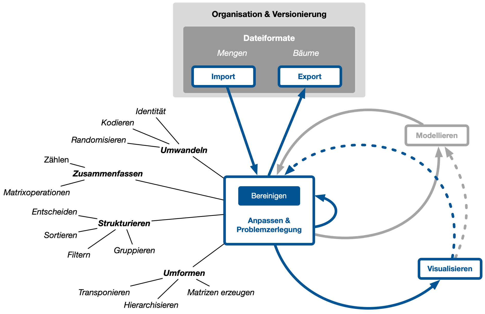

## Motivation und Ausgangslage

## Anwendungen

### Produktion und Logistik

### Steuerung von Geschäftsprozessen

### Medizinische Bildgebung

### Medizinische Diagnostik

### Umweltmonitoring

### Bio-Informatik

## Integration 

Datenzentrische Anweldungen lassen sich in vier Kategorien einteilen:

1. Beschreiben
2. Schliessen und Ableiten
3. Steuern
4. Vorhersagen 

Diese vier Kategorien werden in der Anwendung of kombiniert, so dass sich nicht alle Anwendungen eindeutig zuordnen lassen. 

## Organisation dieses Buchs

### Ziele 

### Aufbau

