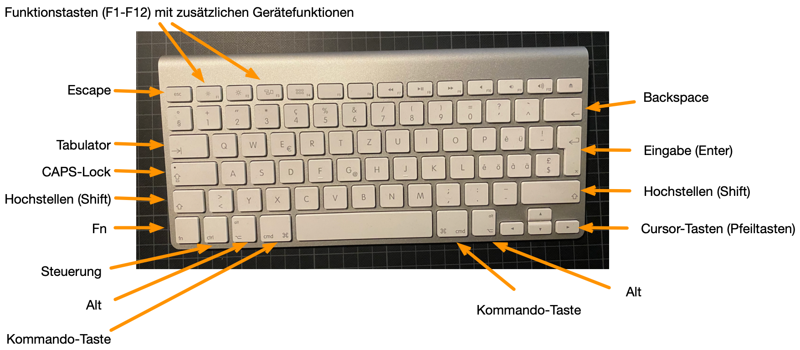
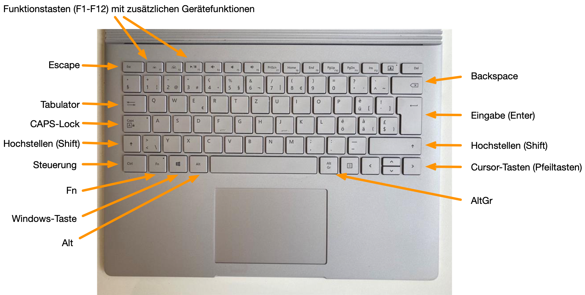

Es gibt verschiedene Tastaturlayouts bei denen wichtige Symbole unterschiedlichen Tasten zugeordnet sind. In diesem Abschnitt werden alle Tastenkombinationen mit Bezug auf die Schweizer Tastatur beschrieben. Auf diesen Tastaturen finden wir das Plus-Symbol (``+``) über der ``1s``. Einige der hier beschriebenen Funktionen sind bei anderen Tastaturlayouts über eine andere Tastenkombination oder auch direkt erreichbar.

Die wichtigsten Standardtasten sind:

- ``Tabulator`` (``tabstopp`` oder ``tab``)
- ``Escape`` (``Esc``)
- ``Backspace`` (gelegentlich ``Rückwärtslöschen``)
- ``Löschen`` (``delete``)
- ``Eingabe`` (``return`` oder ``enter``)
- ``Hochstellen`` (``shift``)
- ``CAPS-Lock`` (dauerhaft Hochstellen)
- Steuerung: ``Strg`` oder ``Ctrl`` (Windows) / ``control`` (Mac)
- ``Alt`` (Windows) / ``option`` (Mac) 
- ``AltGr`` (Windows)
- Funktion: ``Fn`` (meistens auf Laptops)
- Kommando: ``command`` (Mac) / ``Windows`` (Windows)
- Cursor-Tasten

### Mac Tastatur

> Einige **MacBookPro** Modelle verfügen über einen sog. *Touchbar* an der Position, an welcher sich normalerweise die Funktionstasten befinden. Das Drücken der ``Fn``-Taste wechselt die Darstellung aus dem jeweiligen App-Kontext zu virtuellen Funktionstasten. Bei Modellen mit Touchbar aus den Reihen vor 2020 fehlt eine ``Esc``-Taste. Auch diese Taste können Sie mit der ``Fn``-Taste im Touchbar aktivieren.

### Windows Tastatur

**Die ``Windows``-Taste:** Diese Taste befindet sich links neben der ``Leerzeichen``-Taste. Im Gegensatz zur Kommandotaste unter Mac hat die ``Windows``-Taste keine zentrale Funktion im System. Viele Tastaturkürzel, die beim Mac über die ``Kommando``-Taste ausgelöst werden, werden unter Windows über die Steuerungstaste bereitgestellt. Die ``Windows``-Taste wird unter Windows fast ausschliesslich für Systemfunktionen verwendet.

**Die ``AltGr``-Taste:** Auf Ihren Tastaturen sehen Sie auf manchen Tasten zusätzliche Symbole. Diese Symbole können Sie unter Windows nur über die ``AltGr``-Taste erzeugen. Das ist unter Windows die einzige Funktion der ``AltGr``-Taste.
Der Grund dafür ist, dass europäische Computertastaturen einen grösseren Zeichenumfang als eine US-Tastatur (die sog. ANSI Tastatur) haben. Weil alle Programmiersprachen die Symbole der US-Tastatur verwenden, müssen die europäischen Tastaturen diese
Symbole zusätzlich bereitstellen. Unter MacOS sind diese Symbole über beide ``Alt``-Tasten erreichbar.

### Modifikatoren und Abkürzungen

Gelegentlich benötigen wir Tastenkombinationen, bei denen wir mehrere Tasten gleichzeitig drücken. Dabei kommen die Tasten ``Hochstellen``, ``Alt`` und ``Steuerung`` entweder einzeln oder kombiniert als *Modifikatoren* zum Einsatz.

> **Definition**: Modifikatoren-Tasten haben keine eigene Bedeutung, sondern **modifizieren** die Bedeutung einer anderen Taste.

Die folgenden Tasten sind immer Modifikatoren:

 - `Hochstellen`
 - `CAPS-Lock`
 - `Alt` / `AltGr`
 - `Steuerung`
 - `Fn`
 - `Kommando` (Mac) / `Win` (Windows)

Um nicht immer die Taste in ganzer Länge anzugeben, werden diese Modifikatoren abgekürzt. Die folgenden Buchstaben stehen für die folgenden Modifikatortasten.

| Taste | Symbol | 
| :--- | :--- | 
| Hochstellen | `S` | 
| Alt (Win) / option (Mac) | `M` |
| Steuerung | `C` |

Alle anderen Tasten werden mit ihrem Namen angegeben.

Um eine Tastaturkombination anzuzeigen, werden die zu drückenden Tasten mit ``+`` verknüpft. Z.B. ``M + C + q`` bedeutet, dass Sie die Tasten ``Alt``, ``Steuerung`` und ``Q`` **gleichzeitig** drücken müssen.

> Tasten die nacheinander gedrückt werden sollen, werden durch Leerzeichen getrennt. Z.B. ``C + q a`` bedeutet, dass Sie zuerst die Tasten ``Steuerung`` und ``Q`` **gleichzeitig** tippen und **danach** die
Taste ``A`` drücken müssen.

### Funktionstasten

Als Funktionstasten werden normalerweise die Tasten rechts neben der ``Esc``-Taste bezeichnet. Diese Tasten sind oft mit ``F1``-``F12`` beschriftet. Viele Anwendungen haben diese Tasten mit speziellen Funktionen belegt. Das gilt besonders für Excel.

Auf modernen Laptops und vielen Desktoptastaturen sind diese Tasten standardmässig mit Gerätefunktionen wie z.B. Bildschirmhelligkeit oder Lautstärke belegt. Damit wir die eigentlichen Funktionstasten erreichen können, müssen wir deshalb mit der ``Fn``-Taste die Standardfunktion auf die Anwendungsfunktion zurückstellen. Wenn in einer Anleitung steht, dass eine Funktion über eine Funktionstaste erreicht werden kann, dann ist implizit gemeint, dass gleichzeitig die ``Fn``-Taste gedrückt werden muss.

### Kontrollsequenzen

Kontrollsequenzen sind Tastaturkürzel, mit denen wir häufig verwendete Funktionen direkt über die Tastatur aktivieren können. Excel hat für fast jede Funktion im Menüband eine Kontrollsequenz festgelegt. Wir können also Excel auch ohne Maus, sondern ausschliesslich mit der Tastatur bedienen.

Die meisten Kontrollsequenzen sind unter Windows und MacOS identisch. Der zentrale Unterschied ist jedoch, dass Windows die Steuerungstaste (``Strg`` oder ``Ctrl``) verwendet. Unter MacOS muss stattdessen die Kommandotaste (``⌘``    oder ``command``, manchmal auch als ``Apfel``-Taste bezeichnet) verwendet werden. Die Kommandotaste wird für Macs mit ``Cmd`` abgekürzt.

Die wichtigsten systemweiten Kontrollsequenzen funktionieren praktisch mit jeder App und nicht nur in Excel:

| Funktion | Sequenz (Win) | Sequenz (Mac) |
| :--- | :--- | :--- |
| Kopieren | `C + c` | `Cmd + c` | 
| Einfügen | `C + v` | `Cmd + v` | 
| Ausschneiden | `C + x` | `Cmd + x` | 
| Speichern | `C + s` | `Cmd + s` | 
| Rückgängig | `C + z` | `Cmd + z` | 

Für häufig verwendete Funktionen merken Sie sich die Kontrollsequenz. Dadurch können Sie Ihr Arbeitstempo steigern.

### Sonderzeichen

In der Programmierung werden regelmässig Sonderzeichen verwendet, um bestimmte Funktionen auszulösen. Es hilft die Namen und Tastaturkürzel für diese Symbole zu kennen.

Die am häufigsten auftauchenden Sonderzeichen sind:

| Name (englisch) | Symbol | Tasten (Win) | Tasten (Mac) |
| :--- | :---: | :---: | :---: | 
| Apostroph (quote oder tick) | ``'`` |`'`| `'` | 
| Dach (caret) | `^` | `^` | `^` | 
| Anführungszeichen (double-quote) | ``"`` | ``S + 2`` |  ``S + 2`` | 
| Schrägstrich (slash) |  ``/`` | ``S + 7`` | ``S + 7`` | 
| Akzent (back-tick) | `` ` `` | ``S + ^`` | ``S + ^`` | 
| Kaufmännisches Und (ampersand) | ``&`` | ``S + 6`` |  ``S + 6`` |
| Gatter (hash oder gate) | ``#`` | ``AltGr + 3`` | ``M + 3`` | 
| Eckige Klammer auf | ``[`` | ``AltGr + ü`` | ``M + 5`` | 
| Eckige Klammer zu | ``]`` | ``AltGr + !`` | ``M + 6`` | 
| Geschweifte Klammer auf | ``{`` | ``AltGr + ä`` | ``M + 8`` | 
| Geschweifte Klammer zu | ``}`` | ``AltGr + $`` | ``M + 9`` |
| Senkrechter Strich (pipe) | ``\|`` | ``AltGr + 7`` | ``M + 7`` | 
| Rückstrich (backslash) | ``\\`` | ``AltGr + <`` | ``S + M + 7`` | 
| Tilde | ``~`` | ``AltGr + ^`` | ``M + n`` |
| Unterstrich (low dash) | ``_`` | ``S + -`` | ``S + -`` | 

> Merken Sie sich die Bezeichnungen und Symbole, denn Sie werden sie regelmässig verwenden.

