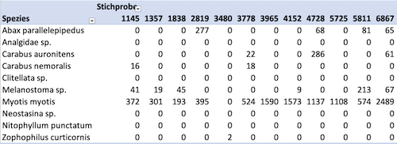
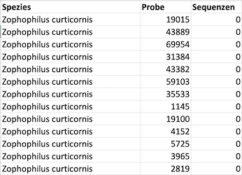

# Daten organisieren

Daten sind das wichtigste Gut der Datenwissenschaften. Deshalb sollte sorgsam und systematisch mit ihnen umgegangen werden. Zu diesem Zweck müssen Daten organisiert werden. 

Das Ziel der Datenorganisation ist es, Daten so zu strukturieren, damit sie einfach und effizient verarbeitet werden können. Zur Datenorganisation gehört die Strukturierung, Ablage, Versionierung und Bereitstellung von Daten.

## Daten strukturieren

Im [Kapitel @sec-chapter-daten-sammeln] wurde die Bedeutung des Datenschemas für das Sammeln von Daten behandelt. Ein Schema gibt vor, welche Werte einen Datensatz bilden. Dieser Abschnitt konzentriert sich auf die Umsetzung des Datenschemas. 

### Daten als Tabellen

Daten werden oft als Tabellen präsentiert. Tabellen sind eine einfache und intuitive Form der *Datenorganisation*. Vorläufig lassen sich Tabellen wie in @def-tabellenstruktur definieren. Diese Definition wird in [Kapitel @sec-chapter-datenstrukturen] erweitert, um verschiedene Datenstrukturen zu unterscheiden.

::: {#def-tabellenstruktur}
**Tabellen** formen eine Datenstruktur, die Zeilen und Spalten hat und in der alle Zeilen die gleiche Breite und alle Spalten die gleiche Länge haben.
:::

Tabellen organisieren Daten in Zeilen und Spalten, wobei jede Zeile und jede Spalte eine Überschrift haben kann.

::: {#def-vektornamen}
Die Überschriften einer Tabelle werden als *Namen*, bzw. *Spaltennamen* und *Zeilennamen* bezeichnet. 
:::

Eine bestimmte Spalte in einer bestimmten Zeile heisst *Tabellenzelle* oder schlicht *Zelle*. Eine Zelle enthält genau einen Wert.

@def-tabellenstruktur legt fest, dass eine *Tabelle* keine Zellen haben kann, die sich über mehrere Zeilen oder Spalten erstrecken. Viele Publikationen zeigen jedoch Datenstrukturen mit solchen Zellen. Solche Datenstrukturen sind keine Tabellen im Sinne von @def-tabellenstruktur. 

::: {#def-tabellarisch}
Eine tabellenartige Struktur mit Tabellenzellen, die sich über mehr als eine Zeile oder eine Spalte erstrecken heisst **tabellarische Darstellung**.
::: 

*Tabellarische Darstellungen* dienen der *Präsentation* von Daten und Ergebnissen. Sie sind nicht für die *Datenorganisation* geeignet.

::: {.callout-tip}
In Berichten und Publikationen wird *nicht* zwischen *Tabellen* und *tabellarischen Darstellungen* unterschieden. Beide Strukturen werden unter *Tabellen* zusammengefasst. Beide Strukturen einheitlich als *Tabelle* beschriftet und nummeriert. 

**Diese Vereinfachung ist nur für die *Präsentation* von Daten erlaubt.** 
:::

### Begriffe

Tabellen dienen zur systematischen Erfassung von Daten. Meist repräsentieren Tabellen Messungen, die später ausgewertet und analysiert werden sollen. Die Datenorganisation in Tabellen strukturiert Daten entlang zwei Dimensionen. Für die Datenerfassung werden die Daten in *Zeilen* und *Spalten* organisiert, wobei die Spalten meistens als *Merkmale* und die Zeilen als *Messereignisse* bezeichnet werden. Gemeinsam bilden die Merkmale und Messereignisse eine *Stichprobe* (engl. *sample*).

::: {#def-merkmal}
Ein **Merkmal** ist eine Eigenschaft, die in einer Messung durch einen *Messwert* erfasst wird. In der Statistik werden Merkmale in der *Statistik* als **Variablen** bezeichnet.
:::

Ein Merkmal ist immer als Vektor organisiert. Alle Werte eines Merkmals haben also den gleichen Datentyp und den gleichen Wertebereich.

::: {#def-messereignis}
Ein **Messereignis** fasst ein oder mehrere *gemeinsam gemessenen* Merkmale zusammen. Ein Messereignis wird auch als **Datensatz** bezeichnet. Bei der Datenvisualisierung werden Messereignisse als **Datenpunkte** bezeichnet.
:::

Ein Datensatz ist immer eine Liste von Werten, deren Datentypen und Wertebereichen voneinander verschieden sein können.

::: {.callout-note}
Der Begriff *Datensatz* wird im Deutschen mehrdeutig verwendet. Es ist nicht immer klar, ob ein Datensatz ein Zeile in einer Tabelle oder eine ganze Tabelle bezeichnet. Im Englishen wird der Begriff *Datensatz* entweder mit *data record* (etwa Dateneintrag) für eine Zeile in einer Tabelle benutzt. Die Begriffe *data set* (Datenmenge) oder *data frame* (Datenraster) bezeichnen eine ganze Tabelle. 
:::

Die *Merkmale* beschreiben gemeinsam ein *Messereignis*. Weil es sich bei den Merkmalen eines Messereignisses um *zusammengehörende* Werte handelt, wird auch der Begriff **Entität** (gegebene Einheit; eindeutig identifizierbare, zusammenhängende Größe) verwendet.

Messungen bilden einen Ausschnitt einer **Grundgesamtheit** ab. Eine Grundgesamtheit umfasst alle *prinziell* messbaren Entitäten. Eine Stichprobe ist eine *Teilmenge* der Grundgesamtheit, die nur die *tatsächlich gemessenen* Entitäten enthält. 

::: {#def-grundgesamtheit}
Alle prinzipiell messbaren Entitäten bilden eine **Grundgesamtheit**.
::: 

::: {#def-stichprobe}
Eine **Stichprobe** ist die Gesamtheit der gemessenen Entitäten ab.
::: 

Die **Statistik** befasst sich mit den Methoden, um von Stichproben auf die ursprüngliche **Grundgesamtheit** zu schliessen. Aus Sicht der Datenwissenschaft und Datenverarbeitung ist die Grundgesamtheit *unerheblich*, weil die nicht gemessenen Entitäten nicht in den Daten nicht abgebildet sind und deshalb unbekannt bleiben müssen!

### Daten normalisieren

Ein Datensatz kann Werte aus einer oder mehreren Messungen beinhalten. Wenn mehrere *unabhängige* Messungen in einem Datensatz zusammengefasst werden, dann beschreiben die entsprechenden Vektoren die *gleichen Merkmale* aus unterschiedliche Messereignissen.

::: {#def-unabhängige-messungen}
**Unabhängige Messungen** sind Messungen für die gleichen Merkmale zu unterschiedlichen Zeitpunkten.
:::

Eine Stichprobe mit unabhängigen Messungen für die gleiche Entität ist *nicht normalisiert*.

@fig-nicht-normalform zeigt einen Ausschnitt einer Stichprobe mit Werten aus mehreren unabhängigen Messungen bzw. Messereignissen. Jeder Vektor in dieser Stichprobe entspricht dabei unabhängigen Messungen. 

{#fig-nicht-normalform}

Ein **Messereignis** bezeichnet das gleichzeitige Erheben zusammengehörender Daten. Wenn beispielsweise das gleiche Objekt zu unterschiedlichen Zeitpunkten gemessen wird, dann liegen *unabhängige Messereignisse* vor. 

Wenn Daten in einer Tabelle jeweils ein Messereignis repräsentieren, dann liegen sie in **Normalform** vor. In der Normalform ist die Tabelle gleichbedeutend mit der zugehörigen Stichprobe. Jede Zeile ist der Datensatz einer beobachteten Entität. Die Spalten repräsentieren die Messungen.

::: {.callout-note}
Beachten Sie, dass *unabhängige Messereignisse* nicht mit *unabhängigen Variablen* in der Statistik verwechselt werden darf.
:::

::: {#def-normalform}
Die **Normalform** einer Stichprobe ist eine Tabelle, in der jedes Merkmal genau einmal vorkommt und alle Werte in einem Datensatz zum gleichen Messereignis gehören.
::: 

@fig-normalform zeigt einen Ausschnitt der Normalform der Stichprobe aus @fig-nicht-normalform. Die Normalform einer Stichprobe erscheint auf dem ersten Blick unübersichtlicher als Varianten mit mehreren Messereignissen pro Datensatz. Die Normalform hat jedoch den Vorteil, dass die Stichprobe *einfacher* verarbeitet werden kann.

{#fig-normalform}

::: {.callout-tip}
## Praxis

Weil die Normalform oft schwer lesbar ist, werden Daten für die *Präsentation* in *nicht-normalisierter* Form bereitgestellt. Die Grundlage für diese Darstellung der Daten sollte möglichst die Normalform sein.

Beim Datensammeln sollte möglichst die Normalform eingehalten werden. 
:::

::: {#exm-room-temp}
## Raumtemperatur und Helligkeit

Die am Montag um 13 Uhr gemessene Temperatur und Helligkeit gehören zum gleichen Messereignis. Wird die Messung am Dienstag um 8 Uhr wiederholt, dann gehört die Temperatur und Helligkeit ebenfalls zum gleichen Messereignis. 

Die Normalform dieser Daten wäre entsprechend:

| Tag | Uhrzeit | Temperatur | Helligkeit |
| --------- | -----: | ------: | -----: |
| Montag | 13 | 21.5 | 0.9 |
| Dienstag | 8 | 22.1 | 0.5 |

Die Temperatur am Montag und 13 Uhr und am Dienstag um 8 Uhr sind *unabhängige* Messereignisse für die Temperatur. Werden die Werte nicht-normalisiert gegenübergestellt, können Menschen die Werte oft leichter vergleichen. Eine solche Tabelle sähe dann wie folgt aus:

| Temperatur Montag, 13h | Temperatur Dienstag, 8h | Helligkeit  Montag, 13h | Helligkeit  Dienstag, 8h |
| -----: | -----: | ------: | -----: |
| 21.5 | 22.1 | 0.9 | 0.5 |

Diese zweite Tabelle macht deutlich, dass viele nicht normalisierte Tabellen einen Teil der Daten in Vektornamen kodieren. Diese Daten sind für die Datenverarbeitung nur indirekt zugänglich. Deshalb sollten Daten möglichst in der Normalform vorliegen.
::: 

## Daten ablegen

### Dateien und Verzeichnisse

Datendateien sollten möglichst isoliert und vor versehentlichen überschreiben geschützt werden.

Daten werden am Besten immer in eigenen Dateien abgelegt. Diese Dateien enthalten nur Werte und keine Umformungen oder Berechnungen. Wenn ein Projekt mehrere Datenerhebungen umfasst, dann sollten die Daten für jede Erhebung in einer eigenen Datei abgelegt werden. Hierzu sollte eine eindeutige Bezeichnung verwendet werden, die auf die Erhebung hinweist. Ein geeignetes Format für Dateinamen ist ein Datum-Kennungs-Format, die die Erhebung eindeutig identifiziert. Dabei wird das Datum in der Form `YYYY-MM-DD` angegeben, gefolgt von einer kurzen Bezeichnung der Erhebung. 

::: {#exm-datum-kennung}
## Dateiname im Datum-Kennungsformat

```
2020-10-01-erhebung-1.csv
```
:::

Durch die inverse Datumsschreibweise dieses Formats lassen sich die Dateien leicht nach Datum sortieren und schneller wiederfinden.

Damit die Daten von anderen Teilen eines Projekts getrennt werden können, sollten die Daten in einem eigenen Verzeichnis abgelegt werden. Dabei sollte das Verzeichnis einen Namen haben, der anzeigt, dass nur Datendateien in diesem Verzeichnis abgelegt werden. Eine solche Bezeichnung könnte beispielsweise `data` oder `daten` sein.

### Daten-Repositories

Eine deutlichere Trennung der Daten von den Ergebnissen ist mit Hilfe von eigenen *Daten-Repositories* möglich. Dabei werden die Daten separat von den Ergebnissen gespeichert, versioniert und synchronisiert.

Ein Daten-Repository sollte immer nur die Daten eines Projekts enthalten. Das Repository sollte einen Namen haben, der anzeigt, dass es sich um ein Daten-Repository handelt.

Bei der Verwendung eines getrennten Daten-Repositories entfällt die Notwendigkeit, die Daten in einem eigenen Verzeichnis abzulegen. Diese Funktion übernimmt das Repository.

### Datenbanken

Datenbanken sind eine weitere Möglichkeit, Daten zu abzulegen. Datenbanken werden über spezielle Software verwaltet. Sie eigenen sich besonders für die Verwaltung von grossen und kontinuierlich wachsenden Datenmengen, die von mehreren Personen bearbeitet werden und die über eine längere Zeit verfügbar sein müssen. 

Datenbanken haben den Vorteil, dass gezielt Teile der Daten für spezielle Analysen geladen werden können. Dadurch können auch sehr grosse Datenmengen effizient verarbeitet werden.

### Datenverlust vermeiden

Allein die Organisation von Daten in Tabellen, die in den richtigen Dateien in einem eigenen Verzeichnis abgelegt sind, ist keine Garantie, dass die Daten *sicher* sind. Daten können durch *versehentliches Überschreiben* oder *Löschen* verloren gehen. 

Daten können beispielsweise durch *Hardware-Fehler* oder einen anderen Verlust der Hardware verloren gehen. Deshalb sollten Daten gesichert werden. 

Die einfachste Form der Sicherung sind getrennte Speicherorte. Dazu werden die Daten an mindestens zwei Orten gespeichert. Diese Art der Sicherung heisst **Datenreplikation**. Wenn die Daten an einem Ort verloren gehen, können sie über den anderen Ort wiederhergestellt werden. Dazu müssen zwei Bedingungen erfüllt sein: 

1. Die Daten müssen in beiden Daten *vollständig* vorhanden sein.
2. Die Speicherorte müssen *unabhängig* voneinander sein. 

Zum Beispiel ist eine externe Festplatte für Sicherungen eines Laptops kein geeigneter Speicherort, wenn beide Geräte im gleichen Rucksack transportiert werden. Wenn der Rucksack verloren geht oder gestohlen wird, wären die Daten auf der externen Festplatte ebenfalls verloren.

Die **Versionierung** der Daten ein wichtiges Instrument zur Vermeidung von Datenverlusten. Moderne Versionierungssysteme arbeiten dabei zweistufig (s. @sec-chapter-github): 

1. Die Daten werden lokal *versioniert*, so dass die Daten aus den Versionierungspunkten wiederhergestellt werden können.
2. Die Versionen werden in der verteilten Versionsverwaltung *synchronisiert*. Dadurch werden die Daten automatisch *repliziert*.

Durch diese Vorgehensweise sind die Daten an mindestens zwei Orten gespeichert. Wenn die Daten an einem Ort verloren gehen, können sie über den anderen Ort wiederhergestellt werden.

Die dritte Technik zur Vermeidung von Datenverlusten ist die **Archivierung**. Für die Datenarchivierung werden die Daten gebündelt und in einem *Archiv* abgelegt. Die Archivierung erfolgt meist nach Abschluss eines Projekts oder einer Studie. Alternativ sollten Daten bereits archiviert werden, sobald die Datenerhebung abgeschlossen wurde.

::: {.callout-tip}
## Praxis
Versionierungssysteme wie git können aus Versionen von Daten *automatisch* Archivdateien erzeugen. git Hosting-Plattformen bieten hierfür eigene Ablagen. Die Archivdateien können anschliessend an einem sicheren Ort abgelegt werden.
:::

::: {.callout-warning}
## Datenbanken sind kein Ersatz für Sicherungen

Obwohl Datenbanken eine sehr gute Möglichkeit sind, Daten zu verwalten, sind sie kein Ersatz für Sicherungen. Datenbanken können zwar Daten *speichern*, aber sie können keine Daten *sichern*. 

Eine Datenbank kann erst dann einen Datenverlust vorbeugen, wenn die Datenbank selbst gesichert wird. Das bedeutet, dass die Datenbank zumindest repliziert werden muss.
::: 

## Datenmanipulation

Nach dem Importieren und vor dem Exportieren muss die *Datenintegrität* sichergestellt werden. Das bedeutet, dass zwischen allen Werten und Ergebnissen eine systematische Verbindung besteht. Werte dürfen deshalb nicht *willkürlich* verändert, gelöscht oder hinzugefügt werden. 

Ein grosses Problem bei der Arbeit mit Daten ist die *nachträgliche Datenmanipulation*. Dabei werden die erhobenen Daten verändert, wobei sich die Veränderung nicht einwandfrei reproduzieren lässt. 

::: {#def-datenmanipulation}
Eine **Datenmanipulation** heisst jede Veränderung von Daten bei denen Werte unsystematisch hinzugefügt, beliebige Werte verändert oder gelöscht werden.
:::

Weil nach einer Datenmanipulation die ursprünglichen Daten nicht mehr eindeutig reproduziert werden können, lassen sich die Ergebnisse nicht mehr bestätigen oder wiederlegen. Das kommt einem vollständigen Datenverlust gleich, denn alle vorliegenden Daten können manipuliert worden sein. 

::: {.callout-important}
## Keine Datenreproduktion möglich
Wird eine Datenmanipulation entdeckt oder ist eine Manipulation sehr wahrscheinlich, dann ist es **nicht mehr möglich**, die ursprünglichen Daten zu reproduzieren. In diesem Fall gelten **alle Daten** eines Datensatzes als **komprimitiert**. Solche Daten dürfen auf keinen Fall für Analysen weiterverwendet werden.
:::

Eine Datenmanipulation muss von der systematischen Datenverarbeitung abgegrenzt werden. Bei der systematischen Datenverarbeitung werden Daten mit Hilfe von Werkzeugen und definierten Methoden verarbeitet. Dabei gehen keine Daten verloren, werden neue Werte erzeugt oder bestehende Werte verändert. Bei der systematischen Datenverarbeitung lassen sich alle Ergebnisse aus den ursprünglichen Daten herleiten.

Falls Werte erzeugt werden, dürfen diese nicht willkürlich mit den ursprünglichen Daten vermischt werden. Stattdessen sind solche neuen Werte von den Daten zu trennen. 

::: {.callout-tip}
## Praxis
Generierte Werte dürfen nur über eine Kodierung ([@sec-daten-kodieren]) mit den ursprünglichen Daten verknüpft werden. Die Kodierung muss so gestaltet sein, dass die ursprünglichen Daten jederzeit reproduziert werden können.
:::

::: {.callout-note}
## Merke

Um eine systematische Datenverarbeitung belegen zu können, müssen **Daten**, **Ergebnisse** und **alle Operationen**, die von den Daten zu den Ergebnissen, vorgehalten werden. 
:::

::: {.callout-tip}
## Keine Datenmanipulation
Solange alle Werte im Rahmen des Schemas erhalten bleiben, liegt keine Datenmanipulation vor. Dazu gehören insbesondere:

- Nachvollziehbare logische, methodische und systematische Fehler.
- Korrektur von Vektornamen/Variablen und deren Übersetzung in eine andere Sprache.
- Begründetes Runden, wenn dadurch keine Datenverzerrung entsteht. Als Richtlinie gilt die Messgenauigkeit der verwendeten Instrumente.
- Umbenennen von Dateien und Verzeichnissen.
- Umwandlung von Masseinheiten, z.B. Konvertierung von Grad Fahrenheit in Grad Celsius.
- Anonymisierung von Datensätzen.
:::

Es gibt zwei Arten der Datenmanipulation. 

Die **absichtliche Manipulation** von Daten erfordert *aktives Eingreifen* einer Person mit Zugang zu den Daten. ist ein schweres professionelles Delikt. Diese Art von Manipulation kann das Löschen von unpassenden Daten sein, das Verändern von Werten betreffen bzw. Werte für die Studienergebnisse *passend machen* oder auch neue Daten *erfinden*. Solche Datenmanipulationen wiegen wissenschaftlich oft schwerer als Plagiarismus und können bei professionellen Analysen als Urkundenfälschung gewertet werden.

Die **versehentliche Datenmanipulation** kommt sehr viel häufiger vor als eine absichtliche Datenmanipulation. Die versehentliche Datenmanipulation kann viele Ursachen haben und reicht von der fehlerhaften Bedienung von Tools und Werkzeugen über Software-Fehler bis zum Überschreiben von Daten mit Ergebnissen. 

Eine sehr häufig vorkommende Form der versehentlichen Datenmanipulation ist die automatische Datentyperkennung von Excel. Dabei werden Daten beim Import oder bei der Eingabe in einer Excel-Arbeitsmappe in einen *unerwünschten* Datentyp geändert, wobei sich auch der Wert der Daten ändert. Wenn durchgehend mit Excel gearbeitet wird, müssen diese Fehler vorgebeugt werden. Diese Praktiken erfordern von allen Beteiligten eine grosse Arbeitsdisziplin, was sich im Alltag nicht immer fordern lässt. Deshalb ist es oft einfacher, die Daten in einem einfacheren Dateiformat (z.B. CSV oder JSON) zu erfassen und anschliessend diese Daten in Excel als externe Daten zu importieren.

::: {.callout-tip}
## Praxis

Um versehentliche Datenmanipulation zu vermeiden, sollte ausser bei Messungen **nie** direkt mit den Daten gearbeitet werden. Stattdessen sollten die Daten **immer** in einer separaten Datei gespeichert und versioniert werden. Aus dieser Datei werden die Daten anschliessend *importiert* und *bearbeitet*. Die Ergebnisse können in *andere* Dateien *exportiert* werden.

Durch die Versionierung kann jederzeit auf die ursprünglichen Daten zurückgegriffen und wiederhergestellt werden, selbst wenn sie versehentlich oder absichtlich überschrieben oder gelöscht wurden. 
::: 
