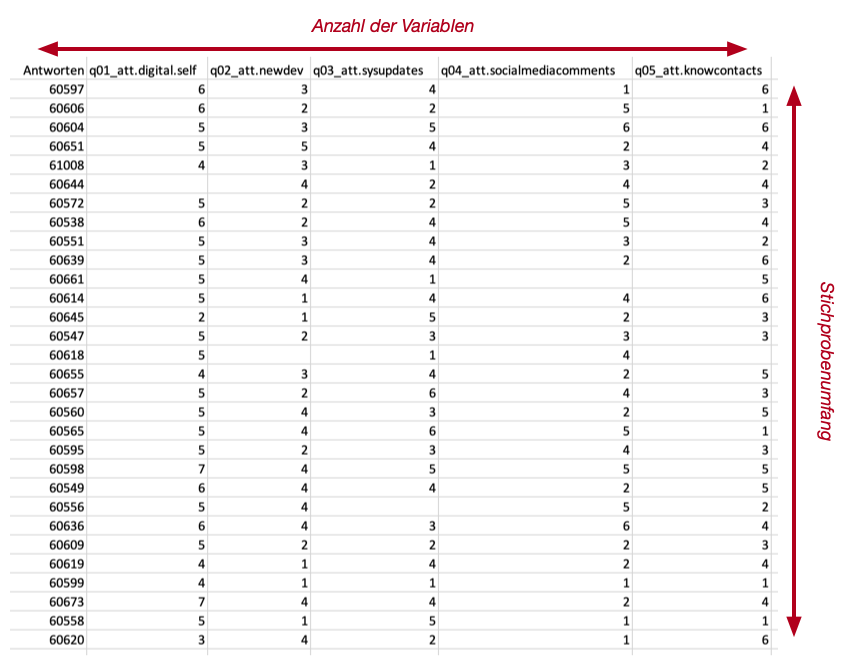

## Universelle Kennzahlen

Wir haben das Zählen mit R und Excel kennengelernt. Diese Operation wenden wir an, um die zwei universellen Kennzahlen von Stichproben zu bestimmen. 

::: {#def-universelle-kennzahlen} 
Mit **universellen Kennzahlen** sind abgeleitete Werte gemeint, die wir für *alle* Stichproben bestimmen können. 
:::

Die beiden universellen Kennzahlen für Stichproben sind: 

- Der *Stichprobenumfang*, d.h. die Anzahl der Datensätze 
- Die *Anzahl der Variablen*

Wir erkennen sofort, dass es sich bei der Bestimmung der beiden Kennwerte um ein **(Ab-) Zählproblem** handelt. 

::: {.callout-note}
## Merke
In **jeder** wissenschaftlichen Arbeit, in der Sie Daten präsentieren, **müssen** Sie **immer** die beiden Kennwerte angeben. 
:::

Für die Anzahl der Variablen könnten wir im Prinzip auf die Dokumentation einer Stichprobe zurückgreifen. Wir bestimmen trotzdem *beide* Kennzahlen, um sicherzustellen, dass wir wirklich alle Variablen in einer Stichprobe berichten und nicht versehentlich Variablen unterschlagen, die in der Dokumentation nur implizit festgehalten werden.

::: {.callout-tip}
## Konvention
Stichprobenumfänge werden in wissenschaftlichen Arbeiten mit dem Buchstaben `n` gekennzeichnet. 
:::

::: {.callout-tip}
## Konvention
In **Fragebogenstudien** wird die Anzahl der Vektoren als Anzahl der **Items** bezeichnet. Damit sind die unabhängig festgehaltenen Antwortmöglichkeiten gemeint. 
:::

::: {.callout-tip}
## Konvention
In **technischen Studien** wird die Anzahl der Vektoren als Anzahl der *Parameter*, *Vektoren* **oder** *Variablen* bezeichnet. Damit sind die unabhängigen, gemessenen Merkmale gemeint.
:::

Bei beiden Kennzahlen müssen wir eine Anzahl bestimmen.  Beim **Stichprobenumfang** bestimmen wir die Anzahl der Datensätze. Für die **Anzahl der Variablen** müssen wir die Vektoren zählen. 

::: {.callout-note}
## Merke
Stichprobenobjekte sind immer **rechteckig**. Alle Variablen sind immer in allen Datensätzen vorhanden (horizontaler Umfang) und alle Datensätze haben für jede Variable einen Wert (vertikaler Umfang).  Wir erhalten die Kennwerte, indem wir horizontal und vertikal zählen.
:::

{#fig-stichprobenkennwerte}


::: {.callout-note}
Die Aufgabe der Deskriptivstatistik ist es, Daten prägnant zusammenzufassen. 

@sauer_moderne_2019, S. 103
:::

Die deskriptive Statistik wird oft mit wenigen Sätzen in der Literatur abgehandelt und auf die folgenden Punkte beschränkt. 

1. Umfang
1. Skalenniveau
1. Lagemasse

Das Zitat von Bortz & Schuster deutet bereits an, dass jeder *schliessenden Statistik* eine Stichprobenbeschrreibung mit Hilfe beschreibender Kennwerte vorangehen **muss**. Dabei müssen wir für die Beschreibung angemessene Lagemasse für das jeweilige Skalenniveau einer Variable wählen. Hier müssen wir etwas aufpassen und zwischen drei Arten von Vektoren in unseren Stichprobendaten unterscheiden: 

1. Konstanten
2. Indikatoren
3. Variablen

::: {.callout-note}
Nur die **Variablenvektoren** können unsere Stichprobe beschreiben, weil Sie *gemessene Merkmalsausprägungen* unser Entitäten enthalten. 
:::

Im folgenden arbeiten wir mit einer Beispielstichprobe. Diese Stichprobe ist ein Ausschnitt aus einer Studie zur Relevanz von digitalen Kompetenzen bei Dozierenden während des ersten COVID-Lockdowns im FS2020. 

## Umfang

Mit dem Umfang einer Stichprobe meinen wir die *Anzahl der Entitäten*, die wir gemessen haben. In R ergibt sich dieser Wert direkt aus dem Stichprobenobjekt: Der **Stichprobenumfang** entspricht der **Anzahl der Datensätze** in unserem Stichprobenobjekt. Diese Anzahl bestimmen wir mit Hilfe der `count()`-Funktion oder innerrhalb einer Transforrmation mit `mutate()` mit Hilfe der `n()`-Funktion.

Der *Stichprobenumfang* ist einer der drei allgemeinen Kennwerte, die jede Stichprobe beschreiben. Wir bestimmen zuerst die numerischen Kennwerte unserer Beispielstichprobe.

```R
# Stichprobenumfang
stichprobe %>% 
    count() %>% 
    pull() -> stichprobenumfang

stichprobenumfang

stichprobe %>% 
    names() %>% 
    length()
```

Dabei erkennen wir, dass der Stichprobenumfang 27 beträgt. Wir erkennen zusätzlich, dass wir 53 Vektoren in unserem Stichprobenobjekt vorliegen haben.

Neben dem *Stichprobenumfang* unterscheiden wir zusätzlich den *Variablenumfang*. Der **Variablenumfang** bezeichnet  die **Anzahl der gemessenen Merkmalsausprägungen**. Damit ist die Gesamtzahl der gemessenen Werte für eine Variable gemeint. Für diesen Wert müssen wir für eine Variable *nicht vorhandene* Werte aus der Variable entfernen. Diese Werte sind in R mit dem Wert `NA` gekennzeichnet. Wir entfernen die `NA`-Werte mit Hilfe der `drop_na()`-Funktion.

Es ist normal, dass sich der Stichprobenumfang und die Variablenumfänge unterscheiden. Diese Unterschiede entstehen dadurch, dass nicht alle Messungen erfolgreich verlaufen. Zum Beispiel passiert es häufig, dass Teilnehmende bei einem Fragebogen nicht alle Fragen beantworten oder beantworten können. In solchen Fällen ist der Stichprobenumfang grösser als die jeweiligen Variablenumfänge. So kommt es regelmässig vor, dass verschiedene Variablenumfänge sich ebenfalls unterscheiden. 

Die deskriptive Statistik muss daher **immer** den Stichprobenumfang **und** die Variablenumfänge anführen.

## Skalenniveaus und Lagemasse

Für Variablen unterscheiden wir nur die folgenden Skalenniveaus: 

1. Nominal 
2. Ordinal
3. Metrisch (Intervall- oder Varianzskaliert)

Die Skalenniveaus unserer Variablen müssen wir den Vektoren zuordnen können. Dazu müssen wir sowohl die Variablen und Vektoren unserer Stichprobe kennen. Diese Information erschliesst sich nicht aus den Daten, sondern ist in der Regel separat dokumentiert. 

Unsere Beispielstichprobe hat 53 Vektoren. Diese Vektoren sind vier Variablengruppen zugeordnet. Eine Variablengruppe sind unterschiedliche Merkmalsausprägungen mit dem gleichen Skalennivau, die wir in Beziehung setzen. Das Beispiel umfasst die folgenden Variablengruppen und Skalenniveaus: 

1. `q1` ist ein Indikator
2. `q3`, `q4` und `q16` sind nominalskalierte Variablen
  * `q3` hat die Skalierung von `F`, `M`, `X` und `O`. 
  * `q4` hat die Skalierung von `A`, `G`, `L`, `N`, `P`, `S`, `T` und `W`. 
  * `q16` hat die Skalierung von `0` und `1`. 
3. `q10` sind ordinalskalierte Variablen mit der Skalierung von `0`-`10` in ganzzahligen Schritten. Die Messungen stammen von sog. Likert-Skalen.

::: {.callout-tip}
## Übung 
Bestimmen Sie alle Vektorennamen in der Beispielstichprobe.
:::

Für die Variable `q10` es 6 Untermerkmale und für die Variable `q16` gibt es 19 Untermerkmale. Für alle Merkmale in `q10` und `q16` wurden jeweils zwei Aspekte (`0` und `1`) erhoben. Diese Aspekte können für das jeweilige Untermerkmal direkt verglichen werden. Wir haben also im Vektor `q16_13_1` den zweiten Aspekt des 13. Untermerkmals der Variable q16 erfasst. 

### Lagemasse für nominale Skalenniveaus

Für nominale Variablen dürfen wir als Lagemass für die Verteilung nur den *Modus* bestimmen. Damit ist die am häufigsten auftretende Merkmalsausprägung gemeint.

Das zweite "Lagemass" sind die tatsächlich auftretenden Skalenwerte.

Beide Kennwerte erschliessen sich über die *Häufigkeiten* der vorkommenden Werte. Dazu bestimmen wir die Häufigkeit des Auftretens einer Merkmalsausprägung in unserer Stichprobe. Das bestimmen der Häufigkeiten ist eine Abzählaufgabe, bei der wir vorher die gleichen Merkmalsausprägungen gruppiert haben. 

Das folgende Beispiel zwei Varianten für das Feststellen der Häufigkeiten von nominalskalierten Variablen. Die erste Variante ist die direkte Umsetzung des gerade beschriebenen Algorithmus. 
```R
stichprobe %>% 
    group_by(q3) %>% 
    summarise(n = n())
```

<table border="1">
<thead>
	<tr><th scope=col>q3</th><th scope=col>n</th></tr>
	<tr><th scope=col>&lt;chr&gt;</th><th scope=col>&lt;int&gt;</th></tr>
</thead>
<tbody>
	<tr><td>F</td><td>10</td></tr>
	<tr><td>M</td><td>17</td></tr>
</tbody>
</table>

Die zweite Variante verwendet die `count()`-Funktion, um das gleiche Ziel zu erreichen. Die Variante mit `count()` ist etwas leichter zu lesen, weil wir *explizit* klarstellen, dass wir die Merkmalsausprägungen *abzählen*. 

```R
stichprobe %>% 
    count(q4)
```

<table border="1">
<thead>
	<tr><th scope=col>q4</th><th scope=col>n</th></tr>
	<tr><th scope=col>&lt;chr&gt;</th><th scope=col>&lt;int&gt;</th></tr>
</thead>
<tbody>
	<tr><td>N</td><td>17</td></tr>
	<tr><td>P</td><td>10</td></tr>
</tbody>
</table>

Wir können an diesem Beispiel erkennen, dass in unserer Stichprobe nicht alle Ausprägungen der jeweiligen Skalierung in unseren Variablen vorkommen. Uns fällt auch auf, dass die Häufigkeiten für die gemessenen Merkmalsausprägungen der Variablen gleich sind. 

Neben den absoluten Häufigkeiten interessieren uns ebenfalls die *relativen Häufigkeiten*. Diese **müssen** bei der Beschreibung von nominalskalierten Variablen mit angegeben werden. 

Relative Häufigkeiten sind nichts anderes als die prozentualen Anteile der absouluten Häufigkeit in der Gesamtstichprobe. Wir können die relativen Häufigkeiten leicht aus den absoluten Häufigkeiten bestimmen.

```R
stichprobe %>% 
    count(q4) %>%
    mutate(
        prozent = n / sum(n)
    )
``` 

Damit erhalten wir die prozentualen Anteile für alle beobachteten Merkmalsausprägungen. 

::: {.callout-warning}
## Achtung
Beachten Sie hier, dass `n` den Vektor `n` bezeichnet, der durch den Aufruf der `count()`-Funktion erzeugt wird. Sie dürfen diesen Vektor nicht mit der Funktion `n()` verwechseln! Die `n()`-Funktion liefert die Anzahl der Datensätze einer Stichprobe. Nachdem wir `count()` aufgerufen haben, ist das Ergebnis von `n()` in diesem Beispiel gleich `2`. 
:::

Wir können nun leicht den **Modus** der Variable mit Hilfe der `max`-Aggregation bestimmen. Anstelle der `summerise()`-Funktion verwenden wir jedoch besser die `filter()`-Funktion, um auch das zugehörige Skalenniveau zu erhalten.

```R
# Bestimmen des Modus von q3
stichprobe %>% 
    count(q3) %>%
    filter(n == max(n))
```

<table border="1">
<thead>
	<tr><th scope=col>q3</th><th scope=col>n</th></tr>
	<tr><th scope=col>&lt;chr&gt;</th><th scope=col>&lt;int&gt;</th></tr>
</thead>
<tbody>
	<tr><td>M</td><td>17</td></tr>
</tbody>
</table>

::: {.callout-tip}
Der **Modus** ist in der deskriptiven Statistik  nur in Ausnahmefällen von Bedeutung. Eine solche Ausnahme liegt vor, wenn aus mehreren Merkmalsausprägungen der Modus den stark überwiegenden Anteil in der Stichprobe ausmacht. Dieser Anteil ist ungefähr ab einer relativen Häufigkeit von `.75` oder grösser gegeben. In solchen  Fällen sollten Sie trotzdem die Häufigkeiten der anderen Merkmalsausprägungen berichten.
:::

### Lagemasse für metrische Skalenniveaus

Die grundlegenden Kennwerte für  metrische Skalenniveaus sind die *Bandbreite*, die sich aus dem kleinsten (*Minimum*) und grössten gemessenen Wert (*Maximum*) ergibt. 

Für metrischskalierte Variablen können wir immer den Median und Quantile bestimmen, wobei wir uns in der Regel auf die *Quartile* beschränken. Bei der Beschreibung der Quartile geben wir immer den *Interquartilsabstand* mit an. Dieser ist das Gegenstück zur Bandbreite und zeigt uns zwischen welchen Ausprägungen die Hälfte der gemessenen Variablenwerte liegen.

Das folgende Beispiel zeigt die Berechnung der relevanten Kennwerte für die Variable `q10_1_0`. Diese Berechnung entspricht der `favstats` der in Sauer (2019) beschriebenen `mosaic`-Bibliothek

```R
stichprobe %>%
    select(q10_1_0) %>%
    drop_na() %>%
    summarise(
        n = n(),
        min = min(q10_1_0),
        max = max(q10_1_0),
        bw = max - min,
        
        iqr = IQR(q10_1_0), # berücksichtigt ausreisser!
        
        q1 = quantile(q10_1_0, .25),
        # q2 = quantile(q10_1_0, .5), # der Median ist die zweite Quartilsgrenze
        md = median(q10_1_0), 
        q3 = quantile(q10_1_0, .75),
        # q4 = quantile(q10_1_0, 1) , # Das Maximum ist die vierte Quartilsgrenze.

        mad = mad(q10_1_0, constant = 1) 
    )
```

::: {.callout-note}
## Merke
Diese Ergebnisse werden nicht interpretiert! 
:::

::: {.callout-note}
## Merke
Es handelt sich bei diesen Ergebnisse um sog. **á priori Fakten**. Es sind Fakten, die sich direkt aus den Messungen und der Definition der Lagemasse ergeben und keiner weiteren Begründung bedürfen.
:::

### Lagemasse für ordinale Skalenniveaus

Im Unterschied zu den metrischen Skalenniveaus ist der Mittelwert und die Standardabweichung für *ordianle Skalenniveaus* **nicht definiert**. Ausserdem werden Quartilsgrenzen und die davon abhängigen Variablen *etwas* anders berechnet als bei metrischskalierten Variablen. Damit wir keine Folgefehler für die spätere Analyse erhalten müssen wir für ordinalskalierte Variablen die entsprechenden Kennwerte richtig berechnen. 

::: {.callout-warning}
## Achtung
In vielen Fällen ergeben die verschiedenen Berechnungsarten die *gleichen Ergebnisse*. Das bedeutet nicht, dass die Ergebnisse in *allen* Fällen gleich und damit austauschbar sind!
:::

> Die Berechnungsart wird mit dem Parameter `type` festgelegt. Dieser Parameter können wir die Ganzzahlen von `1` bis `8` übergeben. Der Standardwert für diesen Parameter ist `7`. Die Werte `1`, `2` und `3` sind für die Berechnung bei ordinalen Skalenniveaus gedacht. Die anderen Werte beschreiben verschiedene Varianten für metrische Skalenniveaus. 

::: {.callout-note}
Verwenden Sie nur die Werte `1` für ordinale Skalenniveaus und `7` für metrische Skalenniveaus. Weil `7` der Vorgabewert ist, wird dieser bei metrischen Skalenniveaus einfach weggelassen. 
:::

Alle anderen Werte für den `type`-Parameter sind für besondere Fälle, wenn Ergebnisse aus anderen Quellen kontrolliert werden müssen. 

Das folgende Codesegment zeigt Berechnung der statistischen Kennwerte für ordinale Skalenniveaus. 

```R
stichprobe %>%
    select(q10_1_0) %>%
    drop_na() %>%
    summarise(
        n = n(),
        min = min(q10_1_0),
        max = max(q10_1_0),
        bw = max - min,
        
        iqr = IQR(q10_1_0, type = 1), # berücksichtigt ausreisser!
        
        q1 = quantile(q10_1_0, .25, type = 1),
        # q2 = quantile(q10_1_0, .5, type = 1), # der Median ist die zweite Quartilsgrenze
        md = median(q10_1_0, type = 1), 
        q3 = quantile(q10_1_0, .75, type = 1),
        # q4 = quantile(q10_1_0, 1, type = 1) , # Das Maximum ist die vierte Quartilsgrenze. 

       mad = mad(q10_1_0, constant = 1)
    )
```
